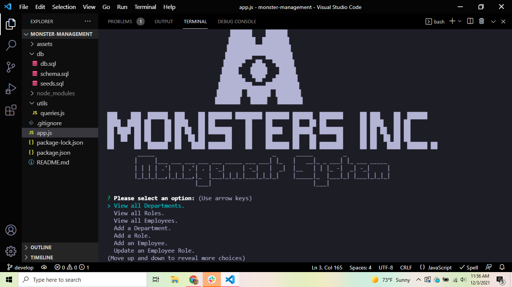
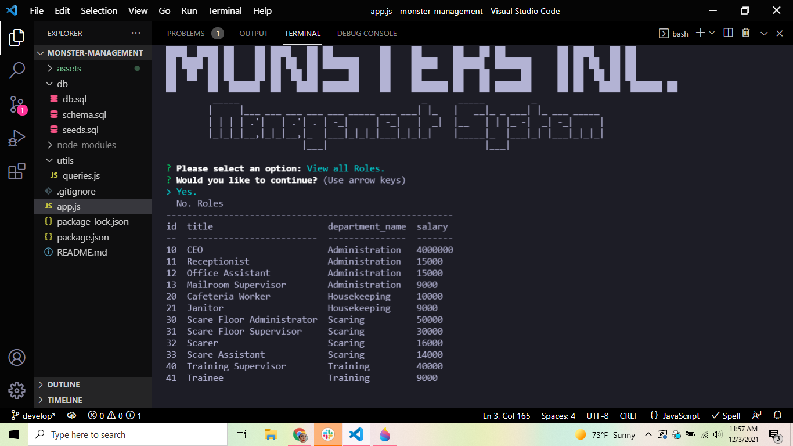

# Monster Manager 👾👔

## Description

* Monster Manager is a Node.js app that I created to further my knowledge on MySQL and to practice building Content Management Systems.
* I decided to use Monsters Inc as a fake business to seed my database and it was a lot of fun!
* I first started the project by creating the sql database and schema to create the necessary tables for our departments, roles and employees. Then I created the sql seeds to populate the tables with various characters from Monsters Inc.
* After our database was created I moved onto writing the javascript, which I did in two files the app.js and queries.js. My app file is mainly the inquirer prompts. The answers from the various prompts get sent to the queries file where I wrote out our queries for accessing the database.
* I wasn't sure if I wanted to add the result table when an object is changed/deleted or to create a console.log saying "It's been changed!". I decided on the table instead of the log even though it doesn't look as nice because this app is mainly for me to learn and I was interested in viewing all the changes that were happening. This could be quickly changed in a refactor if it is a problem.
* I went for a couple of the extra credit and didn't realize until watching the video that the salary sums were supposed to be by department oops! It was still pretty cool to learn the SUM function though :)
* Overall I had a lot of fun creating this app and learned a lot. It was a challenge but nothing too difficult and very satisfying when everything fell into place.

## Table of Contents

* [Usage](#usage)
* [Credits](#credits)
* [License](#license)

## Usage

To use Monster Manager, download the code and then use your computer terminal to find the correct folder. Next make sure your package files are installed then start the app by typing "node app" in your terminal. Follow the prompts that appear to view, add to, and delete departments, roles and employees.

### Screenshot

* 
* 

### Links

* [VideoDemo](https://drive.google.com/file/d/18kDH_H9czuoDG4F4f-HjWe8AAH94hxOg/view?usp=sharing) - link to view video demonstration
* [GitHub](https://github.com/HaileyThomas/monster-manager) - link to GitHub project

## Credits

* Used Node.js, inquirer, mysql, mysql2 and console.table
* Disney Monsters Inc for the fake business idea.

## License

[License](https://opensource.org/licenses/MIT) - link to license

MIT License

Copyright (c) [2021] [Hailey Thomas]

Permission is hereby granted, free of charge, to any person obtaining a copy
of this software and associated documentation files (the "Software"), to deal
in the Software without restriction, including without limitation the rights
to use, copy, modify, merge, publish, distribute, sublicense, and/or sell
copies of the Software, and to permit persons to whom the Software is
furnished to do so, subject to the following conditions:

The above copyright notice and this permission notice shall be included in all
copies or substantial portions of the Software.

THE SOFTWARE IS PROVIDED "AS IS", WITHOUT WARRANTY OF ANY KIND, EXPRESS OR
IMPLIED, INCLUDING BUT NOT LIMITED TO THE WARRANTIES OF MERCHANTABILITY,
FITNESS FOR A PARTICULAR PURPOSE AND NONINFRINGEMENT. IN NO EVENT SHALL THE
AUTHORS OR COPYRIGHT HOLDERS BE LIABLE FOR ANY CLAIM, DAMAGES OR OTHER
LIABILITY, WHETHER IN AN ACTION OF CONTRACT, TORT OR OTHERWISE, ARISING FROM,
OUT OF OR IN CONNECTION WITH THE SOFTWARE OR THE USE OR OTHER DEALINGS IN THE
SOFTWARE.

## Contribution

Please feel free to use this code and contribute if you'd like to!

## Questions

If you have any questions about this app or it's code please use the links below to contact me.

### Contact

* [Email](mailto:haileyraebeauty@gmail.com) - Email Hailey Thomas : haileyraebeauty@gmail.com
* [GitHub](https://github.com/HaileyThomas) - GitHub username : HaileyThomas